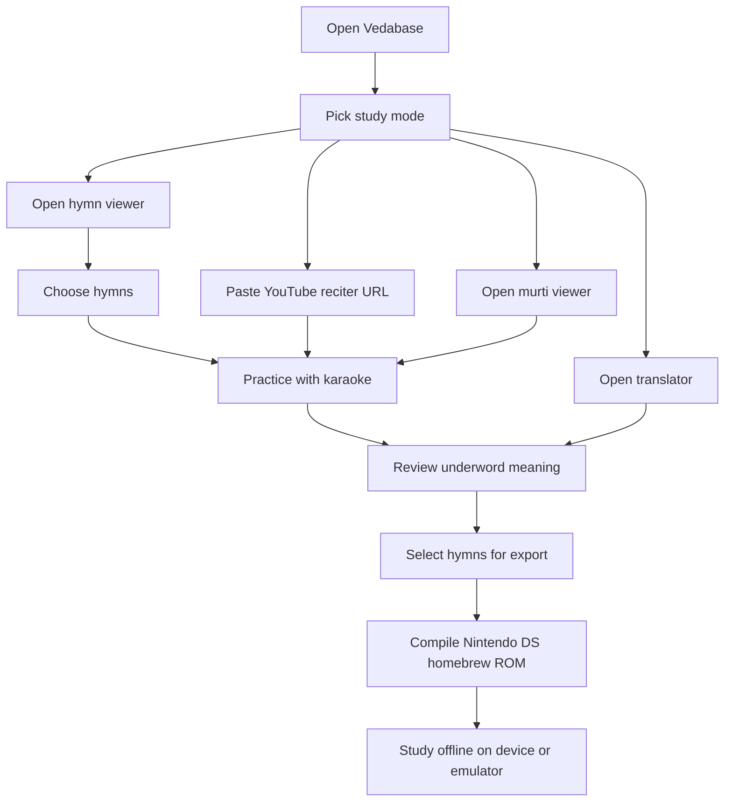

# Vedabase

[](https://github.com/realagiorganization/vedabase/actions/workflows/ci.yml)
[](https://github.com/realagiorganization/vedabase/actions/workflows/pages.yml)
[](https://realagiorganization.github.io/vedabase/docs)
[](https://react.dev/)
[](https://www.typescriptlang.org/)
[](https://vitejs.dev/)
[](https://tailwindcss.com/)
[](./LICENSE)

Vedabase is a desktop/web hymn-learning studio with a matching docs site.

Repository: https://github.com/realagiorganization/vedabase

Docs site: https://realagiorganization.github.io/vedabase/docs

## Phrase By Phrase

- 🕉️ Learn Vedic hymns. Учите ведические гимны.
- 🖥️ Desktop + web. Настольная программа + веб.
- 🎵 Recite with YouTube guidance. Повторяйте с подсказкой YouTube.
- 🎤 Read karaoke lines. Читайте караоке-строки.
- 🔎 Study word by word. Изучайте слово за словом.
- 🌍 Translate phrase by phrase. Переводите фразу за фразой.
- 🛕 View devotional murti concepts. Смотрите devotional murti-концепты.
- 🎮 Build Nintendo DS homebrew hymn ROMs. Собирайте homebrew ROM-файлы Nintendo DS с выбранными гимнами.
- 📚 Choose hymns intentionally. Выбирайте гимны осознанно.
- 🔁 Practice, compare, repeat. Практикуйтесь, сравнивайте, повторяйте.
- 🧪 Mockable APIs, deterministic docs. Мокаемые API, детерминированная документация.
- 🔓 Public docs, no committed secrets. Публичная документация, без закоммиченных секретов.

## Purpose

Vedabase exists to make Vedic hymn learning repeatable on desktop and web, and to package selected hymn sets into a Nintendo DS homebrew ROM build for offline devotional study.

The software combines five surfaces into one study loop:

- 🎵 YouTube reciter
- 🎤 karaoke hymn viewer
- 📖 hymn corpus browser
- 🕉️ underword translator
- 🛕 generative murti viewer

## Programmatic Surface

```text
input.reciter_url      -> guided chanting session
input.hymn_selection   -> hymn reader + karaoke sync
input.study_phrase     -> translation + underword gloss
input.style_choice     -> murti concept preview
input.ds_hymn_bundle   -> Nintendo DS homebrew ROM build target
```

## User Actions Diagram



## Pseudographic Screenshots

### 1. Home / Reciter

```text
+----------------------------------------------------------------------------------+
| Vedabase                                                          [Docs] [Study] |
+----------------------------------------------------------------------------------+
| Learn hymns / Учите гимны                                                         |
| YouTube URL: [ https://youtu.be/chant-example_______________________________ ]    |
| [ Start Practice ]  [ Stop ]  [ Replay ]                                         |
|                                                                                  |
| Modes:  Reciter  |  Hymn  |  Translator  |  Murti  |  DS Export                  |
| Status: idle -> recording -> playback                                            |
+----------------------------------------------------------------------------------+
```

### 2. Karaoke Hymn Viewer

```text
+----------------------------------------------------------------------------------+
| Hymn: Sri Gurvastakam                                               beat: 04/08  |
+----------------------------------------------------------------------------------+
| sri-guru-carana-padma         | Word: guru = teacher                              |
| kevala-bhakati-sadma          | Word: carana = feet                               |
| bando mui savadhana mate      | Active line: >>> kevala-bhakati-sadma <<<         |
|                                                                                  |
| [ Play ] [ Pause ] [ Next line ] [ Save to hymn set ]                            |
+----------------------------------------------------------------------------------+
```

### 3. Underword Translator

```text
+----------------------------------------------------------------------------------+
| Translator                                                          Sanskrit -> EN|
+----------------------------------------------------------------------------------+
| Verse:      gurudeva krpa-bindu diya                                             |
| Phrase EN:  O master, give one drop of mercy                                     |
| Phrase RU:  О учитель, даруй одну каплю милости                                  |
| Underword:  krpa=mercy | bindu=drop | diya=give                                  |
| Pronounce:  gu-ru-de-va kri-pa bin-du di-ya                                      |
+----------------------------------------------------------------------------------+
```

### 4. Murti Viewer

```text
+----------------------------------------------------------------------------------+
| Murti Viewer                                                       style: temple  |
+----------------------------------------------------------------------------------+
| Deity cards: Krishna | Gaura-Nitai | Jagannatha                                  |
| Prompt: serene devotional standing pose with warm gold ornaments                 |
| [ Classic ] [ Temple ] [ Festival ] [ Generate ]                                 |
| Preview: [ devotional image placeholder ]                                        |
+----------------------------------------------------------------------------------+
```

### 5. Nintendo DS Export

```text
+----------------------------------------------------------------------------------+
| DS Hymn ROM Builder                                                 target: NDS   |
+----------------------------------------------------------------------------------+
| Selected hymns:                                                     count: 3      |
|  [x] Sri Gurvastakam                                                            |
|  [x] Gurv-astaka refrain                                                        |
|  [x] Nama-sankirtana chorus                                                     |
| Assets: text | transliteration | timing | cover art | menu labels               |
| [ Validate Set ] [ Build Homebrew ROM ] [ Test in Emulator ]                    |
+----------------------------------------------------------------------------------+
```

## Quick Start

```bash
git clone https://github.com/realagiorganization/vedabase.git
cd vedabase
make install
make dev
```

## Verify Before Commit

```bash
make verify
make verify-strict
make predictive-build-test-all
make act-run
```

## Pages + Generated Docs

- Source-of-truth docs data lives in `src/docs/catalog.json`.
- Generated docs artifacts are built by `npm run docs:generate`.
- The Vite docs route and markdown artifact are both checked by `npm run docs:test`.
- GitHub Pages publishes the generated docs site from `.github/workflows/pages.yml`.

## Security Posture

- No secret keys should be committed.
- Pages output should include the docs route and generated artifacts.
- Public repo/public Pages status must be checked before release, not assumed.

## License

MIT
