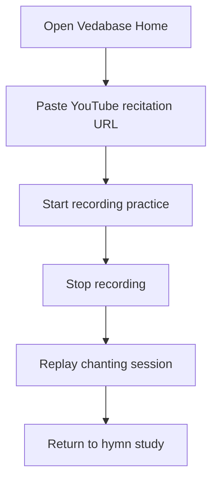
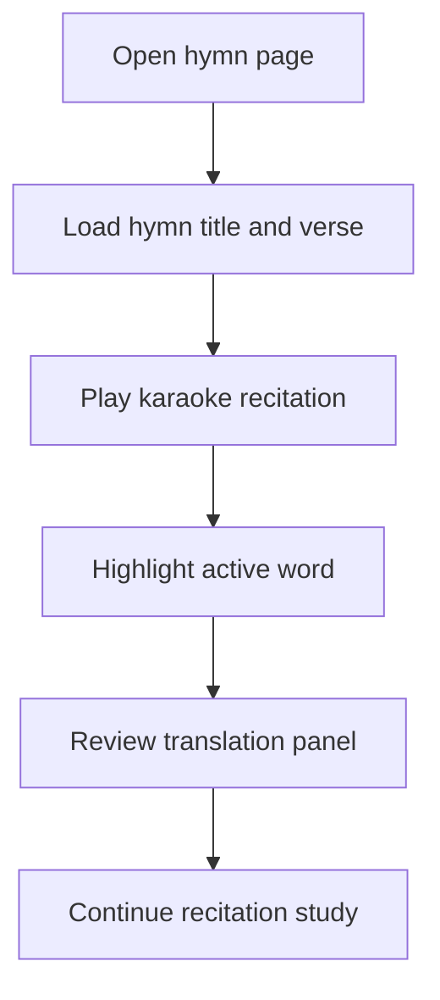
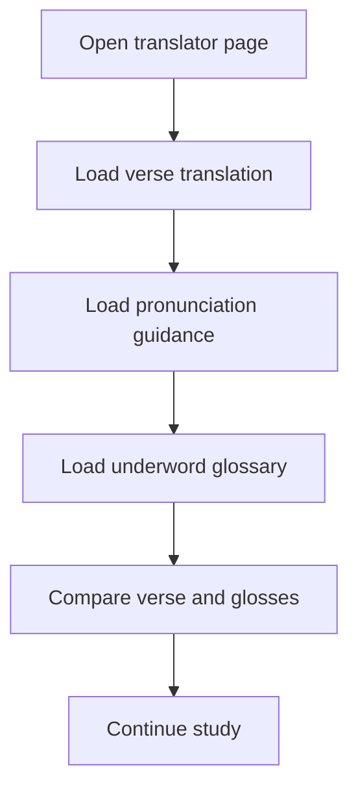
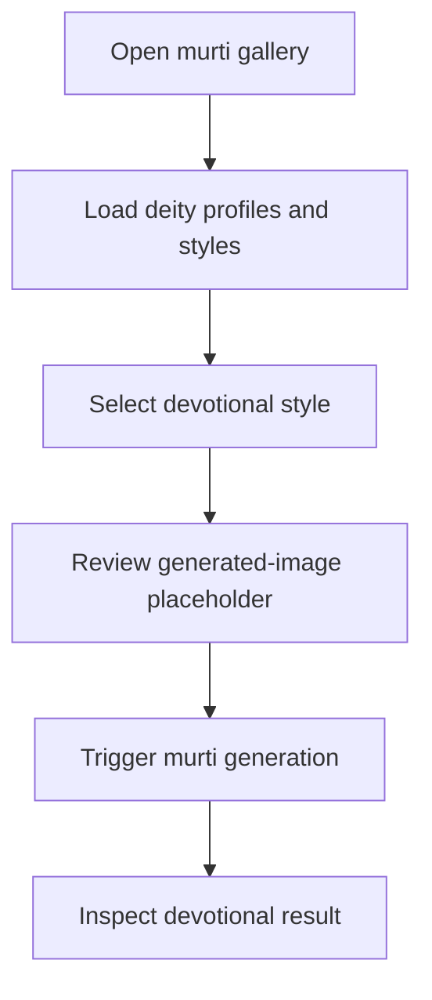

# Vedabase Functionality and BDD

Generated at: 2026-03-28T16:14:31.903Z

Documentation site path: /docs

Feature count: 4
BDD scenario count: 8

## YouTube Reciter

Route: `/`

Guides the devotee from a recitation URL into a playable chanting session scaffold.

### Capabilities

- Capture a YouTube recitation URL
- Expose recording states for start, stop, and playback actions
- Keep the recitation workflow visible alongside hymn discovery

### User Actions

- Open the landing page
- Paste a recitation URL
- Start recording practice
- Stop the recording
- Replay the chanting session

### Acceptance Criteria

- The page presents a URL field and explicit recitation controls.
- The workflow exposes idle, recording, and playback states.
- The recitation scaffold stays reachable from the home experience.

### BDD Scenarios

#### Start guided recitation from a YouTube URL

- Given the learner is on the landing page
- When they paste a valid recitation URL and start the session
- Then the recorder scaffold shows the chanting flow controls

#### Replay a captured practice session

- Given a chanting attempt has been recorded
- When the learner chooses playback
- Then the scaffold returns a playback-oriented state

### Mermaid Sequence

## Karaoke Hymn Viewer

Route: `/hymn`

Pairs verse playback progress with word-by-word highlighting for guided recitation.

### Capabilities

- Load a hymn from the Vedabase mock corpus
- Highlight active words in the transliterated verse
- Keep karaoke and translation content side-by-side

### User Actions

- Open a hymn page
- Wait for hymn content to load
- Play the karaoke recitation
- Follow the highlighted word progression
- Cross-reference the translation panel

### Acceptance Criteria

- The hymn title and metadata appear before interaction continues.
- The karaoke view highlights the active word in the verse stream.
- Translation support is available within the same reading session.

### BDD Scenarios

#### Read a hymn with synchronized highlighting

- Given the user has opened a hymn detail page
- When the hymn data resolves successfully
- Then the karaoke viewer shows the transliteration with an active word highlight

#### Surface a hymn loading failure

- Given the requested hymn cannot be fetched
- When the hymn page finishes loading
- Then the page displays a clear hymn error message

### Mermaid Sequence

## Underword Translator

Route: `/translator`

Combines verse translation, underword segmentation, and pronunciation guidance for study sessions.

### Capabilities

- Translate a Sanskrit verse into a target language
- Return word-level glosses for the same verse
- Expose pronunciation guidance in the same workflow

### User Actions

- Open the translator page
- Inspect source and target language context
- Review pronunciation guidance
- Read the full verse translation
- Study the underword glosses

### Acceptance Criteria

- The translator page shows source and target language context.
- Pronunciation guidance appears beside the translation workflow.
- Underword details remain aligned with the translated verse.

### BDD Scenarios

#### Translate and analyze a verse

- Given the translator page is opened with a sample verse
- When translation, underword, and pronunciation requests resolve
- Then the user sees the translated verse, pronunciation, and word-level glosses together

#### Handle translator service failure

- Given one of the translator services fails
- When the translator page completes loading
- Then the page displays an explicit translation-tools error state

### Mermaid Sequence

## Generative Murti Viewer

Route: `/murti`

Shows deity metadata, selectable devotional styles, and a murti generation trigger.

### Capabilities

- Load curated murti style presets
- Display deity profiles for the current gallery
- Trigger a scaffolded murti generation action

### User Actions

- Open the murti gallery
- Review the active deity filter
- Compare deity cards
- Select a style option
- Trigger murti generation

### Acceptance Criteria

- The gallery lists deity profiles and style presets together.
- Selecting a style clearly updates the active style state.
- A visible murti generation action remains available for each viewer.

### BDD Scenarios

#### Explore deity styles before generation

- Given the user is on the murti gallery page
- When style and deity metadata are loaded
- Then the page shows selectable styles and deity descriptions

#### Preserve generation access after style selection

- Given a style has been selected for a deity
- When the user reviews the selected viewer
- Then the generate murti action remains available in the same panel

### Mermaid Sequence

